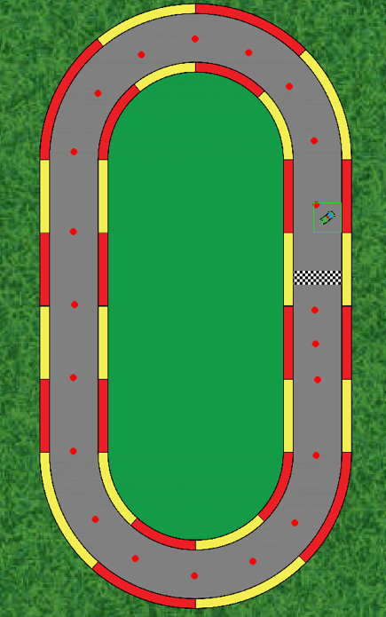
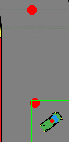
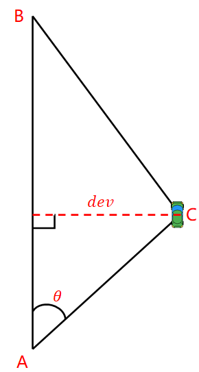
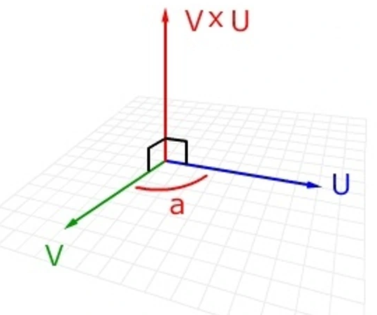

This tiny project build a simple self-driving car environment with python, the vehicle dynamic was derivated from [techwithtim/Pygame-Car-Racer: Make a racing game in Python using pygame! (github.com)](https://github.com/techwithtim/Pygame-Car-Racer). You could also check the videos in his **Youtube** channel for more details.

Thanks to **techwithtim**😘

Configure your python interpreter with `requirements.txt` before running this project.

```
pip install -r requirements.txt
```

Run `DQN_CAR.py`, you could run a car with a simple DQN agent.



**State setting:**





According to the cosine theorem , the offset and angle of the car relative to the midline of the two points can be found.

What's more, the position of the car relative to the centerline is determined by the cross product of the three-dimensional vector (left and right)



When $V \times U > 0$, then the transition from $V$ to $U$ is clockwise, and so on.

And, other related settings can be made in the dynamics file `autocar.py`, such as setting rewards in `ComputerCar.__get_rewards()`!

If you like this project, click on the star😁😁😁!

---


本项目通过python构建了一个简单的自动驾驶车辆环境，车辆动力学灵感来自于[techwithtim/Pygame-Car-Racer: Make a racing game in Python using pygame! (github.com)](https://github.com/techwithtim/Pygame-Car-Racer)，您也可以在YouTube上敢看他的视频进行学习：[(25) Pygame Car Racing Tutorial #1 - Moving The Car - YouTube](https://www.youtube.com/watch?v=L3ktUWfAMPg)

感谢techwithtim！

运行本项目前，请先根据`requiremens.txt`配置好python解释器，非常简单！

```
pip install -r requirements.txt
```

运行`DQN_CAR.py`文件，即可使用DQN算法驱动小车。


**状态设置：**


根据余弦定理，可以求得小车相对于两点构成的中线的偏移量与夹角。

并且，通过三维向量的叉乘判断小车相对于中线的位置（左、右）


当 VxU>0，则从V到U为顺时针，以此类推。

并且，可以在动力学文件`autocar.py`中进行其他相关设置，比如在`ComputerCar.__get_rewards()`中设置奖励！

如果您喜欢这个项目，点击star收藏！😁😁😁

